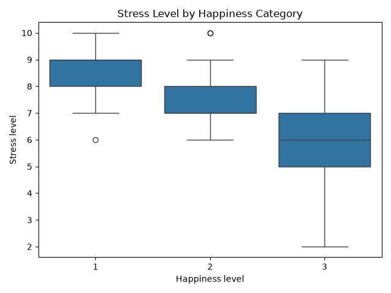
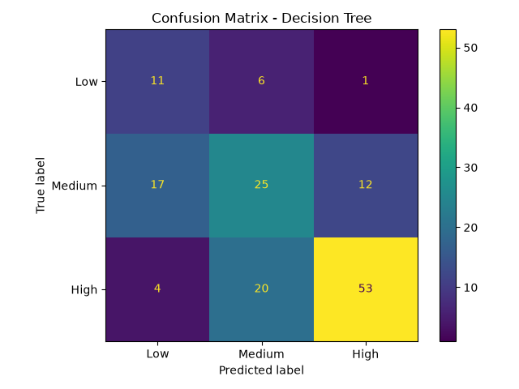
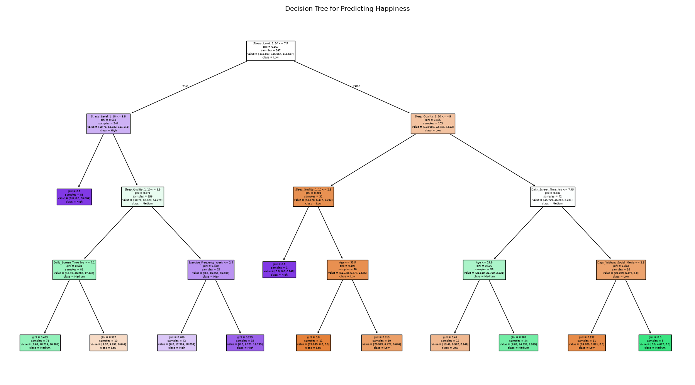

# Social Media and Mental Health Analysis

A data science project investigating relationships between social media usage, stress levels, sleep quality, exercise habits, and self-reported happiness.

## Project Overview

The goal of this project was to explore how various lifestyle and social media behaviors relate to mental well-being. Using a dataset containing demographic information, screen time habits, sleep quality, stress levels, exercise frequency, and happiness ratings, I performed data cleaning, exploratory analysis, unsupervised clustering, and supervised machine learning.

## Technologies Used

- Python
- Pandas
- NumPy
- Matplotlib
- Seaborn
- Scikit-learn

## Project Structure

```text
social-media-mental-health-analysis/
├── data/
│   ├── raw/
│   └── processed/
├── outputs/
│   └── figures/
├── src/
│   ├── clean_data.py
│   ├── kmeans_analysis.py
│   └── decision_tree_model.py
├── requirements.txt
└── README.md
```

## Analysis Pipeline

### 1. Data Cleaning

The raw dataset contained invalid values, inconsistent categories, and missing data.

Cleaning steps included:

- Removing invalid age values
- Standardizing gender categories
- Validating social media platform categories
- Replacing invalid numeric values with median values
- Creating normalized datasets for clustering

### 2. K-Means Clustering

K-Means clustering was applied to identify behavioral groups within the dataset.

Two clustering approaches were compared:

- Including age as a feature
- Excluding age as a feature

This comparison was performed to evaluate whether age dominated cluster formation and obscured behavioral patterns.

### 3. Decision Tree Classification

A decision tree classifier was trained to predict happiness category using:

- Age
- Daily screen time
- Sleep quality
- Stress level
- Days without social media
- Exercise frequency

The model was evaluated using a stratified train-test split and confusion matrix analysis.

## Key Findings

### Stress Level Was the Strongest Predictor

The decision tree consistently selected stress level as the most important feature when predicting happiness category.

### Sleep Quality Played a Major Role

Sleep quality appeared near the top of the decision tree and showed a strong relationship with happiness outcomes.

### Lower Stress Corresponded to Higher Happiness

The exploratory analysis showed a clear inverse relationship between stress levels and self-reported happiness.

### Social Media Usage Alone Was Not the Dominant Factor

While screen time contributed to some decisions within the model, stress and sleep quality appeared to be more influential predictors of happiness.

## Results

### Stress Level by Happiness Category



### Confusion Matrix



### Decision Tree Visualization



## Model Performance

```text
Accuracy: 60%

Class Performance:

Low Happiness:
Precision: 0.34
Recall: 0.61

Medium Happiness:
Precision: 0.49
Recall: 0.46

High Happiness:
Precision: 0.80
Recall: 0.69
```

The model performed best when identifying high-happiness individuals and showed more difficulty distinguishing between low and medium happiness categories.

## Running the Project

Create a virtual environment:

```bash
python3 -m venv .venv
source .venv/bin/activate
```

Install dependencies:

```bash
pip install -r requirements.txt
```

Run the analysis pipeline:

```bash
python src/clean_data.py
python src/kmeans_analysis.py
python src/decision_tree_model.py
```
